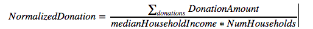
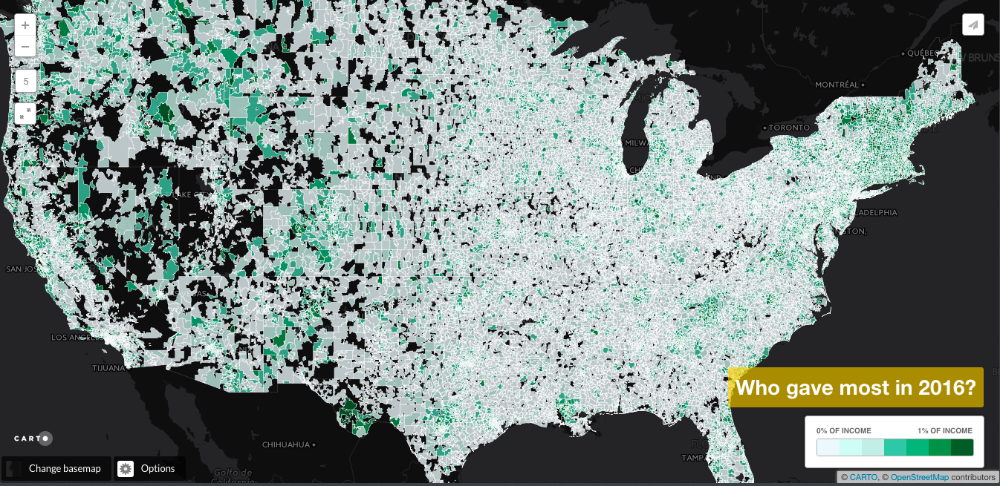

# Giving Tuesday DataKind Dive
Tools: numpy, seaborn, pandas, GeoPandas

Code created during the DataKind #GivingTuesday event on 3/4/2017 as a part of the Transacations team.

When analyzing the individual donations in the context of the whole country it is important to look at the normalized values. This is why I created the code using the following normalization method:

I did it only for donations of less than 200 USD to sift out large donors (one of event's objectives was to increase the individual small donations). 

Deliverable is the code and the following map, which can be accessed at: https://zuzanna.carto.com/viz/999bdc1a-01c1-11e7-9bf4-0e3ff518bd15/map.  

