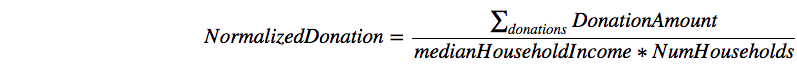

# Giving Tuesday DataKind Dive

Code created during the DataKind #GivingTuesday event on 3/4/2017 as a part of the Transactions team.

purpose: provide a map of small donors normalized by the income to direct marketing campaign more efficiently, especially outside of big cities.

data: I used a subset of transactions data narrowed down to 2016 by executing "cat donations_post_gt.csv | grep 2016 >> donations_post_gt_2016.csv" in the Terminal. 

tools: numpy, seaborn, pandas, GeoPandas

When analyzing the individual donations in the context of the whole country it is important to look at the normalized values. This is why I created the code using the following normalization method:

I did it only for donations of less than 200 USD to sift out large donors (one of event's objectives was to increase the individual small donations). 

Deliverable is the code and the following map, which can be accessed at: https://zuzanna.carto.com/viz/999bdc1a-01c1-11e7-9bf4-0e3ff518bd15/map.  

**Insights:**
Interestingly, when we look at adjusted donation amounts we see that big cities no longer dominate the giving drive. For example, there are ZIP codes areas in south Texas, Utah, Montana and Idaho which donate as much or more than urbanized centers on the West and East Coast. 